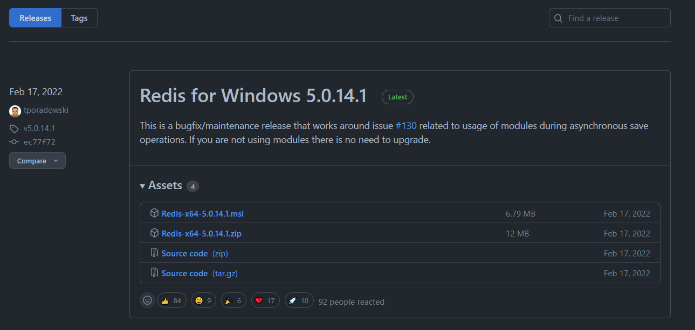
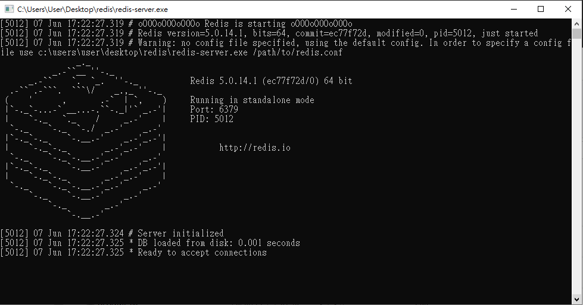

# Example of Celery, Redis and Django

This tutorial will demonstrate setup procedure of celery, redis and django step by step.

packages version(OS : Windows 10)

- `celery==5.2.7`
- `Django==3.2.13`
- `redis==4.3.3`

1. Setup environment

```
mkdir django-celery-redis
cd django-celery-redis
virtualenv env
env\Scripts\activate
pip install django==3.2.13
pip install celery==5.2.7
pip install redis==4.3.3
```

2. Create new django project

```
django-admin startproject demo .
```

3. Create a new file called `celery.py` in `demo` folder, and write down.

```python
import os
from celery import Celery

os.environ.setdefault('DJANGO_SETTINGS_MODULE', 'demo.settings')

app = Celery('demo')

app.config_from_object('django.conf:settings', namespace='CELERY')
app.autodiscover_tasks()
```

- `os.environ.setdefault('DJANGO_SETTINGS_MODULE', 'demo.settings')` makes sure which `settings.py` file is being use.
- `app = Celery('demo')` create a new celery app.
- `app.config_from_object('django.conf:settings', namespace='CELERY')` set configuration of celery app from `settings.py` where variable start with **CELERY.**
- `app.autodiscover_tasks()` discovers decorated tasks within the `tasks.py` inside each `INSTALLED_APPS`.


---


4. Set configuration for celery app.  **Setup your own timezone.**

**Broker** is where the pending tasks stayed.

**Backend** is  where the executed tasks stored.

```python
# demo/settings.py

...

# Celery
CELERY_BROKER_URL = 'redis://localhost:6379'
CELERY_RESULT_BACKEND = 'redis://localhost:6379'
CELERY_ACCEPT_CONTENT = ['application/json']
CELERY_TASK_SERIALIZER = 'json'
CELERY_RESULT_SERIALIZER = 'json'
CELERY_TIMEZONE = 'Asia/Taipei'

...
```

5. In `demo/__init__.py` write down

```python
from .celery import app as celery_app
```

6. Create new app and register

```python
python manage.py startapp example
```

```python
# demo/settings.py

...

INSTALLED_APPS = [
    'django.contrib.admin',
    'django.contrib.auth',
    'django.contrib.contenttypes',
    'django.contrib.sessions',
    'django.contrib.messages',
    'django.contrib.staticfiles',

    'example', # add this
]

...
```

7. Create `tasks.py` in `example/` and build a new task

```python
from celery import shared_task

@shared_task
def add_five(x):
    return x + 5
```

`@shared_task` marked function as a celery task.

8. Download Redis from this link→ [https://github.com/tporadowski/redis/releases](https://github.com/tporadowski/redis/releases), select `RedisXXX.zip`



Unzip and double-click the file called `redis-server.exe`, there will be a popup window looks like this. It means your local redis server is on. **Keep this window live.**



9. Go to terminal, execute `celery -A demo worker -l info -P solo`

`-A` app name

`-l` log level

`-P` pool implement

`-P` is not a common argument when you searching celery tutorial. It seems there is a long-lasting issue for windows users that the tasks will be pending. Add this argument is taken as an solution for this problem. For more information, check

[https://github.com/celery/celery/issues/2146](https://github.com/celery/celery/issues/2146)

[https://stackoverflow.com/questions/27357732/celery-task-always-pending](https://stackoverflow.com/questions/27357732/celery-task-always-pending)

Output will be like, **keep this windows live**

```
(env) C:\Users\User\django-celery-redis>celery -A demo worker -l info -P solo

 -------------- celery@DESKTOP-LSS6R79 v5.2.7 (dawn-chorus)
--- ***** -----
-- ******* ---- Windows-10-10.0.19041-SP0 2022-06-07 20:03:43
- *** --- * ---
- ** ---------- [config]
- ** ---------- .> app:         demo:0x212a724db48
- ** ---------- .> transport:   redis://localhost:6379//
- ** ---------- .> results:     redis://localhost:6379/
- *** --- * --- .> concurrency: 8 (solo)
-- ******* ---- .> task events: OFF (enable -E to monitor tasks in this worker)
--- ***** -----
 -------------- [queues]
                .> celery           exchange=celery(direct) key=celery

[tasks]
  . example.tasks.add_five

[2022-06-07 20:03:43,026: INFO/MainProcess] Connected to redis://localhost:6379//
[2022-06-07 20:03:43,028: INFO/MainProcess] mingle: searching for neighbors
[2022-06-07 20:03:44,057: INFO/MainProcess] mingle: all alone
[2022-06-07 20:03:44,067: INFO/MainProcess] celery@DESKTOP-LSS6R79 ready.
```

**check [tasks] section**, you can see the add_five task.

10. Try to execute a task, execute `python manage.py shell` open python shell, then use `delay()`to execute the task

```
(env) C:\Users\User\django-celery-redis>python manage.py shell
Python 3.7.4 (tags/v3.7.4:e09359112e, Jul  8 2019, 20:34:20) [MSC v.1916 64 bit (AMD64)] on win32
Type "help", "copyright", "credits" or "license" for more information.
(InteractiveConsole)
>>> from example.tasks import add_five
>>> add_five.delay(5)
<AsyncResult: d452626b-779e-411c-9791-562127702eec>
```

then check the terminal output of celery, the message of success showed. `succeeded in 0.0s: 10`

```
...

[2022-06-07 20:08:57,567: INFO/MainProcess] Task example.tasks.add_five[04af45a0-4c04-4c6f-9dec-d19c6ca188d1] received
[2022-06-07 20:08:57,569: INFO/MainProcess] Task example.tasks.add_five[04af45a0-4c04-4c6f-9dec-d19c6ca188d1] succeeded in 0.0s: 10
```

11. What if postpone 5 seconds to finish the task? Let’s add a new task called `add_five_after_5_sec`.

```python
# example/tasks.py
...
import time

...

@shared_task
def add_five_after_5_sec(x):
    time.sleep(5)
    return x + 5
```

user `ctrl + c` (you might need press more than one time) to shut down running celery and restart again. So it could recognize our new tasks.

```
(env) C:\Users\User\django-celery-redis>celery -A demo worker -l info -P solo

 -------------- celery@DESKTOP-LSS6R79 v5.2.7 (dawn-chorus)
--- ***** -----
-- ******* ---- Windows-10-10.0.19041-SP0 2022-06-07 20:15:41
- *** --- * ---
- ** ---------- [config]
- ** ---------- .> app:         demo:0x1ed733edec8
- ** ---------- .> transport:   redis://localhost:6379//
- ** ---------- .> results:     redis://localhost:6379/
- *** --- * --- .> concurrency: 8 (solo)
-- ******* ---- .> task events: OFF (enable -E to monitor tasks in this worker)
--- ***** -----
 -------------- [queues]
                .> celery           exchange=celery(direct) key=celery

[tasks]
  . example.tasks.add_five
  . example.tasks.add_five_after_5_sec

[2022-06-07 20:15:41,301: INFO/MainProcess] Connected to redis://localhost:6379//
[2022-06-07 20:15:41,305: INFO/MainProcess] mingle: searching for neighbors
[2022-06-07 20:15:42,328: INFO/MainProcess] mingle: all alone
[2022-06-07 20:15:42,337: INFO/MainProcess] celery@DESKTOP-LSS6R79 ready.
```

**Restart python shell also,** store `result` as our task. Tasks which haven’t been finished `status` **will be set as pending.**

```
(env) C:\Users\User\django-celery-redis>python manage.py shell
Python 3.7.4 (tags/v3.7.4:e09359112e, Jul  8 2019, 20:34:20) [MSC v.1916 64 bit (AMD64)] on win32
Type "help", "copyright", "credits" or "license" for more information.
(InteractiveConsole)
>>> from example.tasks import add_five_after_5_sec
>>> result = add_five_after_5_sec.delay(8)
>>> result.status
'PENDING'
>>> result.status
'SUCCESS'
```

celery output. `succeeded in 5.0s: 8`

```
...

[2022-06-07 20:33:24,384: INFO/MainProcess] Task example.tasks.add_five_after_5_sec[4402ae9a-7279-49b6-83f9-c3dc4d8b139b] received
[2022-06-07 20:33:29,388: INFO/MainProcess] Task example.tasks.add_five_after_5_sec[4402ae9a-7279-49b6-83f9-c3dc4d8b139b] succeeded in 5.0s: 8
```


## **Routine tasks / Periodic tasks**

We can schedule routine tasks by celery and redis.

First, we create a new tasks called `add_random`

```python
# example/tasks.py
...
import random

...

@shared_task
def add_random(x):
    return x + random.random()
```

Declare routine task in `settings.py`

```python
# demo/settings.py

...

CELERY_BEAT_SCHEDULE = {
    'print_num': {
        'task': 'example.tasks.add_random',
        'schedule': 5.0,
        'args': (5, ),
        'options': {
            'expires': 15.0,
        },
    },
}

...
```

`task` point to where the task is

`schedule` is the frequency of task being executed. The example above is set 5 seconds.

`args` set the arguments for tasks

`expires` is the maximum running time for the task.

`schedule` can also express by `crontrab()`, some examples as below.

check [this](https://docs.celeryq.dev/en/stable/userguide/periodic-tasks.html#:~:text=custom%20scheduler%20classes-,Introduction,entries%20in%20a%20SQL%20database.) for more information.

| Example | Meaning |
| --- | --- |
| crontab() | Execute every minute. |
| crontab(minute=0, hour=0) | Execute daily at midnight. |
| crontab(minute=0, hour='*/3') | Execute every three hours: midnight, 3am, 6am, 9am, noon, 3pm, 6pm, 9pm. |
| crontab(minute=0,hour='0,3,6,9,12,15,18,21') | Same as previous. |
| crontab(minute='*/15') | Execute every 15 minutes. |

**Restart celery** and open a new terminal, execute `celery -A demo beat`, **this two command should both alive.**

The output will be like. It means already on.

```
(env) C:\Users\User\django-celery-redis>celery -A demo beat
celery beat v5.2.7 (dawn-chorus) is starting.
__    -    ... __   -        _
LocalTime -> 2022-06-07 21:08:16
Configuration ->
    . broker -> redis://localhost:6379//
    . loader -> celery.loaders.app.AppLoader
    . scheduler -> celery.beat.PersistentScheduler
    . db -> celerybeat-schedule
    . logfile -> [stderr]@%WARNING
    . maxinterval -> 5.00 minutes (300s)
```

In the mean time, check your celery output might be like..

You can explicitly see the `add_random` tasks being execute every five seconds.

**Congratulation!** 😀

```
(env) C:\Users\User\django-celery-redis>celery -A demo worker -l info -P solo

 -------------- celery@DESKTOP-LSS6R79 v5.2.7 (dawn-chorus)
--- ***** -----
-- ******* ---- Windows-10-10.0.19041-SP0 2022-06-07 21:08:24
- *** --- * ---
- ** ---------- [config]
- ** ---------- .> app:         demo:0x1f19a49dd48
- ** ---------- .> transport:   redis://localhost:6379//
- ** ---------- .> results:     redis://localhost:6379/
- *** --- * --- .> concurrency: 8 (solo)
-- ******* ---- .> task events: OFF (enable -E to monitor tasks in this worker)
--- ***** -----
 -------------- [queues]
                .> celery           exchange=celery(direct) key=celery

[tasks]
  . example.tasks.add_five
  . example.tasks.add_five_after_5_sec
  . example.tasks.add_random

[2022-06-07 21:08:24,359: INFO/MainProcess] Connected to redis://localhost:6379//
[2022-06-07 21:08:24,361: INFO/MainProcess] mingle: searching for neighbors
[2022-06-07 21:08:25,398: INFO/MainProcess] mingle: all alone
[2022-06-07 21:08:25,414: INFO/MainProcess] celery@DESKTOP-LSS6R79 ready.
[2022-06-07 21:08:25,663: INFO/MainProcess] Task example.tasks.add_random[d7cf5674-ab8b-4a80-8424-729e249bd25a] received
[2022-06-07 21:08:25,665: INFO/MainProcess] Task example.tasks.add_random[d7cf5674-ab8b-4a80-8424-729e249bd25a] succeeded in 0.0s: 5.63500975650964
[2022-06-07 21:08:26,225: INFO/MainProcess] Task example.tasks.add_random[22909fc5-75dc-45a5-8256-c9af197ad3af] received
[2022-06-07 21:08:26,226: INFO/MainProcess] Task example.tasks.add_random[22909fc5-75dc-45a5-8256-c9af197ad3af] succeeded in 0.0s: 5.824434102923284
[2022-06-07 21:08:31,225: INFO/MainProcess] Task example.tasks.add_random[f6baaf6c-dfeb-465c-bd9b-cfde3880c44a] received
[2022-06-07 21:08:31,227: INFO/MainProcess] Task example.tasks.add_random[f6baaf6c-dfeb-465c-bd9b-cfde3880c44a] succeeded in 0.0s: 5.562188248150667
[2022-06-07 21:08:36,230: INFO/MainProcess] Task example.tasks.add_random[78ce9ea5-7e06-4ed6-98e8-e5ce522502b8] received
[2022-06-07 21:08:36,231: INFO/MainProcess] Task example.tasks.add_random[78ce9ea5-7e06-4ed6-98e8-e5ce522502b8] succeeded in 0.0s: 5.4807782387369475
[2022-06-07 21:08:41,230: INFO/MainProcess] Task example.tasks.add_random[1fc808d6-5916-4765-a397-9589a8c398b8] received
[2022-06-07 21:08:41,232: INFO/MainProcess] Task example.tasks.add_random[1fc808d6-5916-4765-a397-9589a8c398b8] succeeded in 0.0s: 5.714150792595745
[2022-06-07 21:08:46,230: INFO/MainProcess] Task example.tasks.add_random[79b18fb2-164d-42db-86e6-bc542bd1b545] received
[2022-06-07 21:08:46,231: INFO/MainProcess] Task example.tasks.add_random[79b18fb2-164d-42db-86e6-bc542bd1b545] succeeded in 0.0s: 5.795926389575983
```


## Reference

[https://www.caktusgroup.com/blog/2021/08/11/using-celery-scheduling-tasks/](https://www.caktusgroup.com/blog/2021/08/11/using-celery-scheduling-tasks/)

[https://docs.celeryq.dev/en/stable/userguide/periodic-tasks.html#:~:text=custom scheduler classes-,Introduction,entries in a SQL database](https://docs.celeryq.dev/en/stable/userguide/periodic-tasks.html#:~:text=custom%20scheduler%20classes-,Introduction,entries%20in%20a%20SQL%20database).

[https://docs.celeryq.dev/en/stable/index.html](https://docs.celeryq.dev/en/stable/index.html)

[https://www.youtube.com/watch?v=IcuteHZJlHE&ab_channel=BennettGarner](https://www.youtube.com/watch?v=IcuteHZJlHE&ab_channel=BennettGarner)

[https://www.youtube.com/watch?v=b-6mEAr1m-A&ab_channel=PrettyPrinted](https://www.youtube.com/watch?v=b-6mEAr1m-A&ab_channel=PrettyPrinted)